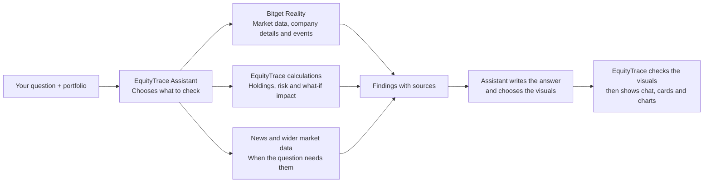

# EquityTrace 📊

**The portfolio-aware AI copilot for tokenized US stocks (rToken) powered by Generative UI.**

---

## 📋 Overview

EquityTrace turns *“What does this mean for my portfolio?”* into an interactive research workflow.

Ask about a Bitget Reality rToken, your portfolio, a thesis, news, or a scenario. EquityTrace processes your question by looking at your existing portfolio, then investigates using live Bitget Reality data and relevant outside context.

EquityTrace combines conversation with live visuals. It explains the research in a text chat on the left, while its **Generative UI instantly renders evidence cards and portfolio impact charts on the right**. This allows you to seamlessly judge how proposed trades or ideas fit your strategy before making your own decision.

---

## 🎯 Why This Matters

Tokenized US stocks (rTokens) turn traditional market hours into 24/7 opportunities. Major world events still happen on weekends while market prices keep moving. As humans, we have to sleep, but markets never stop.

A simple price chart cannot tell you if an rToken actually fits your current portfolio. To make smart decisions when the markets never close, you need a way to instantly see outside news, company events, and exactly how a trade impacts what you already own. EquityTrace solves this by acting as your portfolio-aware copilot, turning real-time market data into a clear, conversational workflow that keeps you fully in control.

---

## 🧩 Architecture

How it works: Every question starts with your portfolio. The assistant chooses what matters, whether that is live prices, market depth, company events such as earnings and dividends, your portfolio risk, or news and crypto market information. EquityTrace calculates the effect of proposed trades and scenarios. The assistant then explains the findings and chooses visuals for that question. EquityTrace checks those visuals against the information gathered before showing them beside the chat.

---

## ✨ Core Features

EquityTrace brings your portfolio, live rToken information, and research into one workspace.

| Feature | What you can do |
| --- | --- |
| 📊 **Portfolio Overview** | See your portfolio value, cash, gains and losses, performance, and allocation at a glance. |
| 🧾 **Portfolio Holdings** | Add, remove, or resize rToken holdings and see what each position contributes to your portfolio. |
| 🔎 **Position Overview** | Inspect a holding’s market and company information, corporate events, simulated trades, and trade history. |
| 📶 **Portfolio Signals** | See your portfolio health score and explore the conditions behind each signal. |
| 🧠 **Portfolio Research** | Ask questions about your holdings, an rToken, news, a proposed trade, or a scenario. |
| 🧭 **Portfolio Risk & Exposure** | Explore risk and return, exposure, and how your holdings move together when enough price history is available. |

### 🧠 Portfolio Research

Portfolio Research helps you investigate a decision in the context of your existing portfolio. Ask a question in plain language. The Assistant gathers relevant information, explains what it found and how it may relate to your portfolio, and shows where the information came from.

You can use it to:

* **Research an asset:** Review its price, company information, events, and relevant news.
* **Understand your portfolio:** Explore your holdings, allocation, and available measures of risk or concentration.
* **Compare choices:** Examine assets or see how a proposed trade could affect your asset and portfolio weights.
* **Explore what-if scenarios:** Adjust a hypothetical price move and see its modeled effect on your holdings.
* **Check the supporting information:** Inspect sources and note when information is unavailable or limited.
* **Continue the investigation:** Ask follow-up questions without starting over.

### 🎨 Generative UI

EquityTrace uses Generative UI because different questions need completely different visuals to improve your research experience. It instantly changes your insights by turning the assistant's answers into a dynamic layout.

Depending on the question, the canvas can show:

* **Prices & Positions:** Displays live asset prices, historical charts, and how they impact your current holdings.
* **Portfolio & Risk:** Breaks down your active positions, how your funds are divided, and your total risk exposure.
* **Scenarios & Testing:** Puts assets side by side and gives you interactive controls to test out trade ideas before making a decision.
* **Research & Context:** Shows company event timelines, live news feeds, and the clear evidence behind your trade idea.
* **Market Conditions:** Tracks real-time market depth, order book balance, crypto trends, and historical asset movements.

## 🔌 Services & Integrations

EquityTrace connects market data and research services to its own portfolio calculations. Each integration has a distinct role in answering a question.

* **Bitget Reality REST:** EquityTrace uses Bitget’s public API at [`api.bitget.com`](https://api.bitget.com) as its primary source for Reality instruments and market information. The app discovers available rTokens and requests their prices, price history, order-book depth, company details, and reported events. For example, it uses `/api/v3/market/instruments`, `/api/v3/market/tickers`, `/api/v3/market/candles`, and `/api/v3/market/orderbook`, among other endpoints.
* **AgentKey MCP:** When a question needs information beyond Bitget’s market and company data, EquityTrace can use AgentKey at [`api.agentkey.app/v1/mcp`](https://api.agentkey.app/v1/mcp) to find relevant news, web, social, macro, or alternative research. The Assistant selects a suitable source when needed, and the resulting information can be shown with its source.
* **Bitget Agent Hub MCP:** EquityTrace can also connect to [`agent.bitget.com/mcp`](https://agent.bitget.com/mcp) for optional last-resort research. It is used only if direct Bitget data, portfolio calculations, and AgentKey cannot provide needed information. If it is unavailable, the Assistant can continue with the findings already gathered.
* **Qwen 3.8 Max:** The Vercel-hosted research API calls Qwen to interpret a question, choose relevant research tools, bring together the returned findings, and select a layout for the canvas. Qwen helps guide the investigation; EquityTrace’s own calculations provide portfolio and scenario figures.
* **SEC EDGAR:** EquityTrace uses SEC company and fund ticker lists to help match underlying assets, then can use company submission metadata to support asset and sector classification. It is supplementary identification and classification data, not a source for live prices or general news. Relevant endpoints include the [SEC company ticker list](https://www.sec.gov/files/company_tickers_exchange.json), [fund ticker list](https://www.sec.gov/files/company_tickers_mf.json), and `data.sec.gov/submissions/CIK{cik}.json`.
* **EquityTrace portfolio calculations:** EquityTrace calculates holdings, exposure, proposed-trade effects, and what-if scenarios using portfolio and market data. This keeps measured figures grounded in application calculations rather than asking an AI model to invent them.

## 🛠️ Tech Stack

EquityTrace is built as a full-stack web app, with its interface, server routes, and research workflow in one project.

* **Next.js 16 and React 19:** Next.js serves the app and its API routes; React powers the interactive portfolio workspace and research canvas.
* **TypeScript 5:** Used across the application to define data structures and keep portfolio, market, and research workflows consistent.
* **Vercel AI SDK:** The `ai`, `@ai-sdk/react`, and `@ai-sdk/openai-compatible` packages support streamed chat, model connections, and tool use in Portfolio Research.
* **MCP and data validation:** `@ai-sdk/mcp` connects the server to MCP services; Zod checks external data and structured inputs before the app uses them.
* **Custom CSS:** The interface is styled with project CSS rather than Tailwind.
* **Supporting UI libraries:** Lucide React supplies icons; React Markdown and `remark-gfm` render formatted Assistant responses.
* **Node.js and npm:** Used to run, build, and manage the project; the README specifies Node.js 20.9 or later.
* **Vercel:** Deploys the Next.js application and its server-side routes.

## 🏆 Hackathon Context

EquityTrace was built for the Bitget AI Base Camp Hackathon S2, Track 3: AI Trading Desk (Open Theme). The track focuses on natural-language research workbenches where AI gathers information, uses tools, and presents analysis while people make the final decisions.
